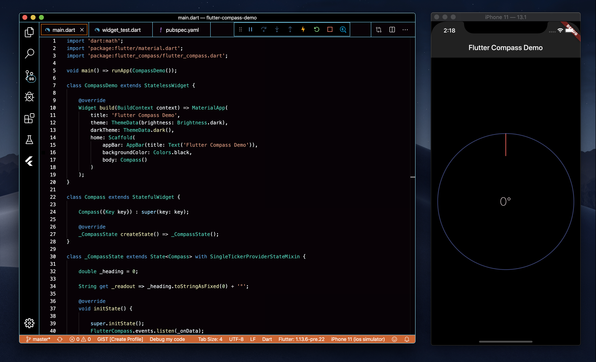

# flutter-compass-demo
Example project demonstrating how to build a compass in Flutter

## Getting Started
To test out this project:

1. If you don't have Flutter yet, grab it [from here](https://flutter.dev)
2. Clone this repo and `cd` into the folder
3. Start the app with `flutter run`